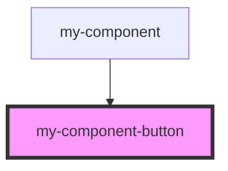

# my-component-button

<!-- Auto Generated Below -->

## Properties

| Property          | Attribute | Description | Type       | Default |
| ----------------- | --------- | ----------- | ---------- | ------- |
| `incrementValues` | --        |             | `number[]` | `[]`    |

## Events

| Event       | Description | Type                  |
| ----------- | ----------- | --------------------- |
| `increment` |             | `CustomEvent<number>` |

## Dependencies

### Used by

 - [my-component](..)

### Graph

----------------------------------------------

*Built with [StencilJS](https://stenciljs.com/)*
